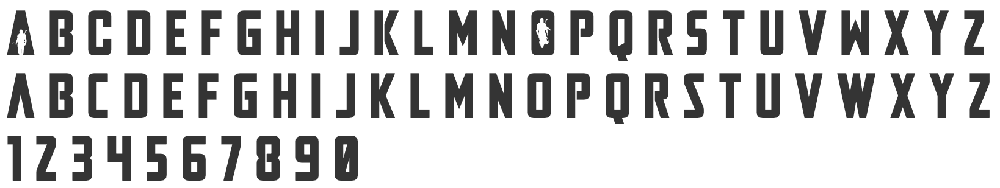

# This is the Way

RESPONSIVE SITE IMAGE TO GO HERE

Team Livin' La Vida Yoda's Game entry for the May the Force be with you Code Institute Hackathon, May 2023.

BLURB ABOUT PROJECT TO GO  HERE

SHIELDS.IO BADGES TO GO HERE

---

## USER EXPERIENCE

### USER STORIES
As a user I would like:
* Clear and concise instructions for the game
* To have consistent feedback on my progress throughout the game (e.g. lives remaining)
* To be able to move Grogu intuitively through the map
* A fun and original game experience with Madolorian music and imagery
* Functionality to turn the music on/off

### DESIGN
We took inspiration for our color scheme from the planet Tatooine (specifically its iconic binary sunset!). Using [Adobe Color](https://color.adobe.com/create/image) we extracted a theme based on this image:

The following colors were selected:
-  Purple 
-  Brown
-  Orange
-  Camel
-  Dusty Pink

We cross referenced the colors using [Eight Shapes](www.https://contrast-grid.eightshapes.com/) to test the contrast and made sure we used readable combinations throughout the website.

#### COLOUR SCHEME

INFO ABOUT COLOUR SCHEME TO GO HERE
#### TYPOGRAPHY

The Mandalorian font is well recogised for its distinctive strong angles and cutout of the Mandalorian in the character A.

We sourced the font Mandalore from [dafonts](https://www.dafont.com/mandalore.font) and then converted the font to a WebFont Kit to allow the font to be used on our site using [transfonter](https://transfonter.org/).

To make the heading 'pop' we have styled it using the text-shadow attribute in the css which gives the font a bit more depth, and also added text-stroke to provide an outline around the text.

INFO ABOUT SPACE FONT HERE

INFO ABOUT BACKUPS SELECTED

#### IMAGERY

Imagery used throughout the site is based on Star Wars and the Mandalorian.

#### WIREFRAMES

### FEATURES

INFO ABOUT THE SITE

FAVICON INFO

### ACCESSIBILITY

## TECHNOLOGIES USED

### LANGUAGES USED

* HTML
* CSS
* JavaScript

### FRAMEWORKS, LIBRARIES & PROGRAMS USED

* [Balsamiq]() - To create the wireframes
* [Git]() - For version control
* [GitHub]() - To store code
* [TinyPNG](https://tinypng.com/) - To compress images
* [Favicon.io]() - To create the favicon
* [Am I responsive]() - For site responsive images
* [Shields.io]() - For badges used in README
* [Kaboomjs](https://kaboomjs.com/) - Game programming library

## DEPLOYMENT & DEVELOPMENT

### DEPLOYMENT

HOW TO DEPLOY INSTRUCTIONS HERE

### LOCAL DEVELOPMENT

#### HOW TO FORK

HOW TO FORK INFO HERE

#### HOW TO CLONE

HOW TO CLONE INFO HERE

## TESTING

Please refer to [TESTING.md](TESTING.md) for all testing carried out.

## BUGS

### SOLVED BUGS

### KNOWNN BUGS

## CREDITS

### CODE USED

### CONTENT

### MEDIA

* [Starfighter ship](https://starwars.fandom.com/wiki/Din_Djarin%27s_N-1_starfighter)
* [Binary Sunsert on Tatooine](https://www.syfy.com/syfy-wire/tatooine-desert-planet-science-star-wars-boba-fett)
### ACKNOWLEDGMENTS

Thank you to the Code Institute and their Hackteam for putting on these amazing events, and to our families who put up with us disappearing for a few days to code like mad!

### TEAM LIVIN' LA VIDA YODA

* [Christian Göran](https://www.linkedin.com/in/christiangoran/)
* [Jody Murray](https://www.linkedin.com/in/jody-murray-4b6818234/)
* [Kera Cudmore](https://www.linkedin.com/in/keracudmore)
* [Megan O'Donohoe](https://www.linkedin.com/in/megan-o-donohoe-29022b264)
* [Soorya George](https://www.linkedin.com/in/soorya-george-6707a024a/)
* [Tanguy L'Alexandre](https://www.linkedin.com/in/tanguy-l-alexandre-a72694272/)
