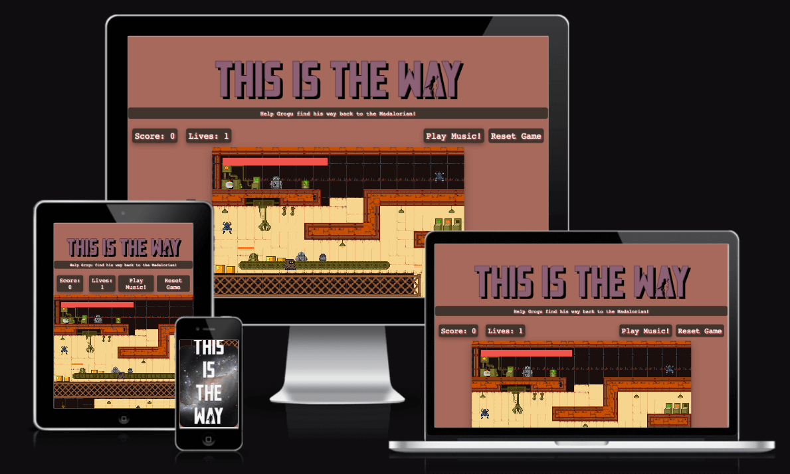
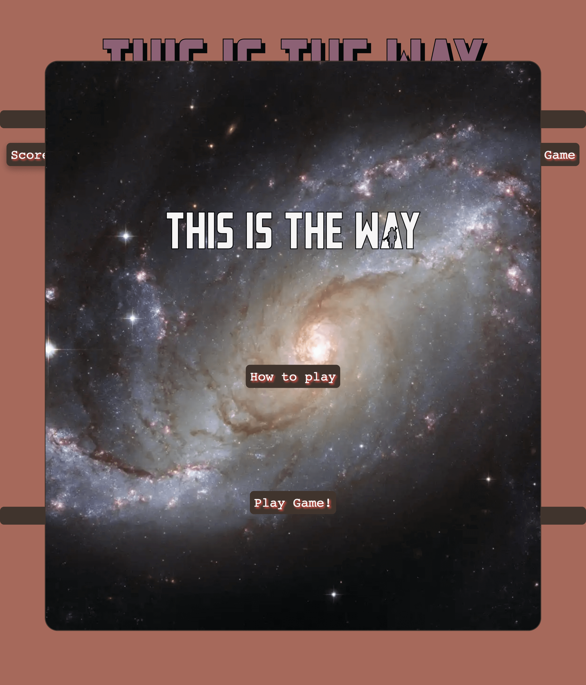
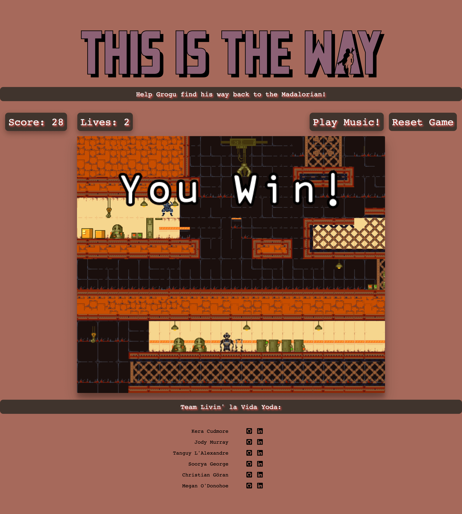
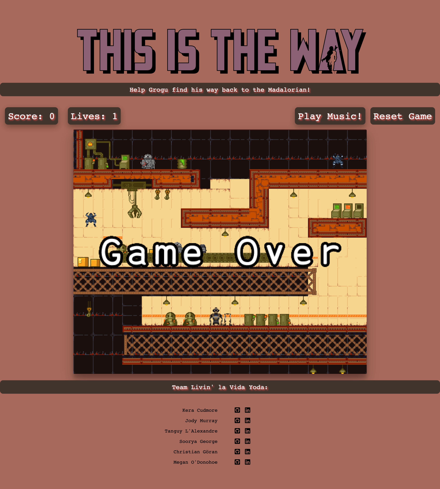

# This is the Way

Team Livin' La Vida Yoda's Game entry for the May the Force be with you Code Institute Hackathon, May 2023.

'This Is The Way' is a one-player game for large screens (not currently available for mobile devices - Patience, my young Padawan!) You play Grogu from 'The Mandolorian', facing off against Jawas and collecting frogs before reuniting with The Mandolorian. Click 'Play Music' to get the full 'Mandolorian' experience!

---

## USER EXPERIENCE

### USER STORIES

As a user I would like:

* Clear and concise instructions for the game
* To have consistent feedback on my progress throughout the game (e.g. lives remaining)
* To be able to move Grogu intuitively through the map
* A fun and original game experience with Madolorian music and imagery
* Functionality to turn the music on/off

### DESIGN

#### COLOUR SCHEME

We took inspiration for our color scheme from the planet Tatooine (specifically its iconic binary sunset!). Using [Adobe Color](https://color.adobe.com/create/image) we extracted a theme based on this image:

The following colors were selected:
-  Purple 
-  Brown
-  Orange
-  Camel
-  Dusty Pink

We cross referenced the colors using [Eight Shapes](www.https://contrast-grid.eightshapes.com/) to test the contrast and made sure we used readable combinations throughout the website.

#### TYPOGRAPHY

The Mandalorian font is well recogised for its distinctive strong angles and cutout of the Mandalorian in the character A.

We sourced the font Mandalore from [dafonts](https://www.dafont.com/mandalore.font) and then converted the font to a WebFont Kit to allow the font to be used on our site using [transfonter](https://transfonter.org/).

To make the heading 'pop' we have styled it using the text-shadow attribute in the css which gives the font a bit more depth, and also added text-stroke to provide an outline around the text.

Space Mono is an original fixed-width type family designed by Colophon Foundry for Google Design. It supports a Latin Extended glyph set, enabling typesetting for English and other Western European languages.

'Monospace' is the back-up font for this site.

#### IMAGERY

Imagery used throughout the site is based on Star Wars and the Mandalorian.

Grogu appears in his floating crib in the game.

 

As the game is based on the planet of Tattoine, the enemies chosen are the Jawa. (Alamite sprites were also created and may appear in future versions of the game)

Grogu's health boost is his favourite snack - a frog.

Sprite.png)

The Mandolorian who appears at the end of the level.

The background for the game was designed to reflect the inside of a sandcrawler vehicle.

#### WIREFRAMES

[Balsamiq](https://balsamiq.com/wireframes/) was used to create our wireframes in the planning stage.

### FEATURES

The site is comprised of two pages, the index page and the 404 page.

#### Start Overlay 
When the site is loaded the user will be shown the start overlay which gives the user the option of learning how to play, and a start button to start playing.

#### Game instructions

#### Game won

Once the player has completed the game, a message is displayed to let them know they were successful!

#### Game lost

If the player loses the game, a message will be displayed to let them know the game is over.

#### Favicon

Our favicon is an image of Grogu and he is displayed within the browser tabs and bookmarks bar.

### ACCESSIBILITY

## TECHNOLOGIES USED

### LANGUAGES USED

* HTML
* CSS
* JavaScript

### FRAMEWORKS, LIBRARIES & PROGRAMS USED

* [Balsamiq](https://balsamiq.com/) - To create the wireframes
* [Git](https://git-scm.com/) - For version control
* [GitHub](https://www.github.com) - To store code
* [TinyPNG](https://tinypng.com/) - To compress images
* [Favicon.io](https://favicon.io/) - To create the favicon
* [Am I responsive](https://ui.dev/amiresponsive) - For site responsive images
* [Shields.io](https://shields.io/) - For badges used in README
* [Kaboomjs](https://kaboomjs.com/) - Game programming library
* [Piskelapp](https://www.piskelapp.com/p/create/sprite) - to create the sprites

## DEPLOYMENT & DEVELOPMENT

### DEPLOYMENT

The site is deployed at GitHub Pages - [This is the Way](https://kera-cudmore.github.io/this-is-the-way/index.html).

To Deploy the site using GitHub Pages:

1. Login (or signup) to Github.
2. Go to the repository for this project, kera-cudmore/this-is-the-way.
3. Click the settings button.
4. Select pages in the left hand navigation menu.
5. From the source dropdown select main branch and press save.
6. The site has now been deployed, please note that this process may take a few minutes before the site goes live.

### LOCAL DEVELOPMENT

#### HOW TO FORK & Clone

A wiki page was created on the repository with instructions on how to fork and clone the project. [View Wiki Page Here](https://github.com/kera-cudmore/this-is-the-way/wiki/Project-Set-Up-for-Collaborators)

These instructions were slightly amended from the amazing instructions on the [Hackathon Git Labs Project](https://github.com/auxfuse/hackathon-git-labs).

## TESTING

Testing was ongoing throughout the entire build. We utilised Chrome developer tools whilst building to pinpoint and troubleshoot any issues as we went along.

During development we made use of google developer tools to ensure everything was working correctly and to assist with troubleshooting when things were not working as expected.

we utilised the console in the developer tools to work through small sections of JavaScript and ensure that the code was working, and also to troubleshoot where issues were.

### W3C Validator

[W3C](https://validator.w3.org/) was used to validate the HTML on all pages of the website. It was also used to validate the CSS.

* [index.html](https://validator.w3.org/nu/?doc=https%3A%2F%2Fkera-cudmore.github.io%2Fthis-is-the-way%2Findex.html)
* [404.html](https://validator.w3.org/nu/?doc=https%3A%2F%2Fkera-cudmore.github.io%2Fthis-is-the-way%2F404.html)
* [style.css](documentation/testing/css-validation.png)

### JavaScript Validator

[jshint](https://jshint.com/) was used to validate the JavaScript.

* [game.js]()
* [music.js](documentation/testing/music-js-testing.png)
* [ee.js](documentation/testing/ee-js-testing.png)

## BUGS

### SOLVED BUGS

| Solved Bug No | Bug | How Resolved |
| :--- | :--- | :--- |
| 1 | Camera Position not working | |
### KNOWNN BUGS

| Bug No | Bug |
| :--- | :--- |
| 1 | Mando not displaying at the end of the game |

## CREDITS

### CODE USED

### CONTENT

### MEDIA

* [Starfighter ship](https://starwars.fandom.com/wiki/Din_Djarin%27s_N-1_starfighter)
* [Binary Sunsert on Tatooine](https://www.syfy.com/syfy-wire/tatooine-desert-planet-science-star-wars-boba-fett)

### ACKNOWLEDGMENTS

Thank you to the Code Institute and their Hackteam for putting on these amazing events, and to our families who put up with us disappearing for a few days to code like mad!

### TEAM LIVIN' LA VIDA YODA

* [Christian Göran](https://www.linkedin.com/in/christiangoran/)
* [Jody Murray](https://www.linkedin.com/in/jody-murray-4b6818234/)
* [Kera Cudmore](https://www.linkedin.com/in/keracudmore)
* [Megan O'Donohoe](https://www.linkedin.com/in/megan-o-donohoe-29022b264)
* [Soorya George](https://www.linkedin.com/in/soorya-george-6707a024a/)
* [Tanguy L'Alexandre](https://www.linkedin.com/in/tanguy-l-alexandre-a72694272/)
